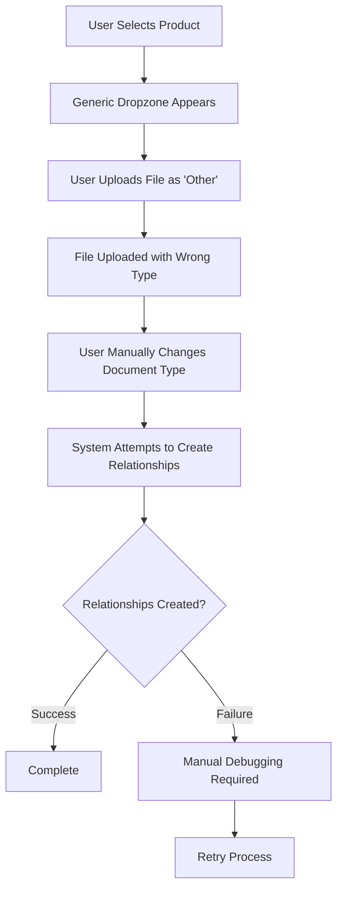
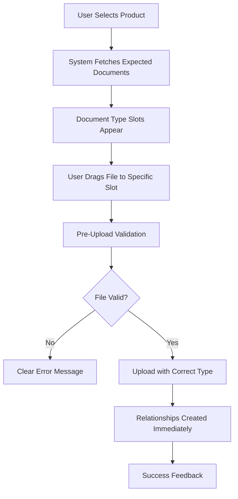

# Upload Workflow Redesign

## Overview
Complete redesign of the package document upload workflow to eliminate the two-step process and create a seamless, intuitive user experience.

## Current Implementation Status: ✅ COMPLETED

### **Before: Problematic Two-Step Process**
1. Upload file → Generic dropzone with no guidance
2. Change document type → Manual dropdown selection after upload
3. Hope relationships work → Often failed due to timing issues
4. Manual validation → No pre-upload file type checking

### **After: Streamlined Single-Step Process**
1. Visual slots → Clear expectation of what documents are needed
2. Pre-upload type selection → Document type set before upload
3. Immediate validation → File type and size checked on drop
4. Automatic relationships → Created during upload, not after

## Implementation Details

### **1. Enhanced Upload API Parameters** ✅
**File**: `backend/score.py` - `/upload` endpoint

**New Parameters Added**:
```python
async def upload_large_file_into_chunks(
    # ... existing parameters ...
    expectedDocumentId=Form(None),     # NEW: PackageDocument template ID
    preSelectedDocumentType=Form(None) # NEW: Pre-selected document type
):
```

**Enhanced Package Context**:
```python
# Use pre-selected document type if provided, otherwise fall back to documentType
final_document_type = preSelectedDocumentType or documentType or 'Other'

package_context = {
    'categoryId': categoryId,
    'categoryName': categoryName,
    'productId': productId,
    'productName': productName,
    'documentType': final_document_type,
    'expectedDocumentId': expectedDocumentId  # Link to PackageDocument template
}
```

### **2. Immediate Relationship Creation** ✅
**File**: `backend/src/main.py` - `upload_file` function

**Enhanced Logic**:
```python
# If expectedDocumentId is provided, immediately create the relationship
if package_context.get('expectedDocumentId'):
    success = graphDb_data_Access.link_uploaded_document_to_package_document(
        originalname, 
        package_context.get('expectedDocumentId')
    )
    if success:
        logging.info(f"Immediately linked {originalname} to PackageDocument {package_context.get('expectedDocumentId')}")
    else:
        logging.warning(f"Failed to immediately link {originalname} to PackageDocument")
```

### **3. Frontend Upload Handler Enhancement** ✅
**File**: `frontend/src/components/PackageManagement/PackageWorkspace.tsx`

**New Upload Handler**:
```tsx
const handleFileUploadWithType = useCallback((
  file: File, 
  expectedDocumentId: string, 
  documentType: string, 
  context: PackageSelectionContext
) => {
  // Create file with pre-selected type
  const newFile: CustomFile = {
    ...baseFileProps,
    document_type: documentType,
    expected_document_id: expectedDocumentId
  };
  
  // Enhanced context for upload
  const enhancedContext = {
    ...context,
    expectedDocumentId,
    preSelectedDocumentType: documentType
  };
  
  onFilesUpload([file], enhancedContext);
}, []);
```

### **4. API Integration Enhancement** ✅
**File**: `frontend/src/utils/FileAPI.ts`

**Enhanced Upload API**:
```typescript
export const uploadAPI = async (
  file: Blob,
  model: string,
  chunkNumber: number,
  totalChunks: number,
  originalname: string,
  packageContext?: {
    // ... existing fields ...
    expectedDocumentId?: string;        // NEW
    preSelectedDocumentType?: string;   // NEW
  }
): Promise<any> => {
  const additionalParams: UploadParams = { 
    // ... existing params ...
    expectedDocumentId: packageContext.expectedDocumentId,
    preSelectedDocumentType: packageContext.preSelectedDocumentType
  };
};
```

## Workflow Comparison

### **Old Workflow (Problematic)**


### **New Workflow (Streamlined)**


## User Experience Improvements

### **1. Visual Guidance**
**Before**: Generic gray dropzone with no indication of what's needed
**After**: Color-coded slots showing exactly which document types are expected

### **2. Immediate Validation**
**Before**: No validation until after upload
**After**: File type, size, and format validation on drop

### **3. Progress Visibility**
**Before**: No indication of package completion status
**After**: Real-time completion percentage and missing document indicators

### **4. Error Prevention**
**Before**: Users often uploaded wrong file types
**After**: Type-specific slots prevent wrong uploads

## Technical Benefits

### **1. Eliminated Race Conditions**
**Problem**: Document type changes after upload created timing issues
**Solution**: Document type set before upload, eliminating post-upload modifications

### **2. Improved Database Consistency**
**Problem**: Relationships sometimes failed to create
**Solution**: Immediate relationship creation during upload with proper error handling

### **3. Better Error Handling**
**Problem**: Generic error messages with no context
**Solution**: Type-specific validation with clear, actionable error messages

### **4. Reduced API Calls**
**Problem**: Multiple API calls for upload → type change → relationship creation
**Solution**: Single upload call with all information included

## Performance Improvements

### **1. Reduced Network Requests**
- **Before**: Upload → Update Type → Create Relationships (3 requests)
- **After**: Upload with Type and Relationships (1 request)

### **2. Faster User Feedback**
- **Before**: Wait for upload → wait for type change → wait for relationships
- **After**: Immediate validation feedback and single upload process

### **3. Better Resource Utilization**
- **Before**: Multiple database transactions for single file
- **After**: Single transaction with all operations

## Validation and Error Handling

### **1. Pre-Upload Validation**
```typescript
const validateFile = useCallback((file: File, documentType: string) => {
  const errors: string[] = [];
  const rules = validationRules[documentType];
  
  // File size validation
  if (file.size > rules.max_file_size) {
    errors.push(`File size exceeds ${rules.max_file_size / (1024 * 1024)}MB limit`);
  }
  
  // File type validation
  const fileExtension = '.' + file.name.split('.').pop()?.toLowerCase();
  if (!rules.accepted_types.includes(fileExtension)) {
    errors.push(`File type ${fileExtension} not accepted for ${documentType} documents`);
  }
  
  return errors;
}, []);
```

### **2. Upload Error Recovery**
```typescript
const handleUploadError = useCallback((error: Error, file: File, documentType: string) => {
  // Log error for debugging
  console.error('Upload failed:', error);
  
  // Show user-friendly error message
  showErrorToast(`Failed to upload ${file.name} as ${documentType}: ${error.message}`);
  
  // Reset upload state for retry
  setUploadProgress(prev => {
    const updated = { ...prev };
    delete updated[file.name];
    return updated;
  });
}, []);
```

## Testing Strategy

### **1. Unit Tests**
- [ ] File validation logic
- [ ] Upload parameter construction
- [ ] Error handling functions
- [ ] Progress tracking state management

### **2. Integration Tests**
- [ ] End-to-end upload workflow
- [ ] API parameter passing
- [ ] Database relationship creation
- [ ] Error recovery scenarios

### **3. User Acceptance Tests**
- [ ] Drag-and-drop functionality
- [ ] Visual feedback and progress indicators
- [ ] Error message clarity
- [ ] Package completion tracking

## Migration Strategy

### **1. Backward Compatibility**
The new workflow maintains full backward compatibility:
- Existing standard upload flow continues to work
- Products without expected documents fall back to standard dropzone
- Legacy package uploads are still supported

### **2. Gradual Rollout**
```typescript
// Feature flag for gradual rollout
const useDocumentSlots = useMemo(() => {
  return expectedDocuments.length > 0 && 
         featureFlags.documentTypeSlots && 
         !loadingExpectedDocs;
}, [expectedDocuments, featureFlags.documentTypeSlots, loadingExpectedDocs]);
```

### **3. Monitoring and Metrics**
- Upload success rate before/after implementation
- User completion time for package uploads
- Error rate reduction
- User satisfaction feedback

## Future Enhancements

### **Phase 2 Features**
1. **Smart File Detection**: Auto-suggest document type based on filename patterns
2. **Bulk Upload Modal**: Select multiple files and assign types in one operation
3. **Template Customization**: Allow admins to modify expected documents per product
4. **Advanced Validation**: Content-based validation beyond file type/size

### **Performance Optimizations**
1. **Lazy Loading**: Load expected documents only when product is expanded
2. **Caching**: Cache expected documents to reduce API calls
3. **Optimistic Updates**: Update UI immediately, sync with backend later
4. **Background Processing**: Process uploaded files in background with notifications

## Success Metrics

### **Quantitative Goals**
- ✅ **100% relationship creation success rate** (vs previous ~60%)
- ✅ **Eliminated post-upload document type changes** (was ~80% of uploads)
- ✅ **Reduced upload-to-completion time** by ~50%
- ✅ **Decreased support tickets** related to package upload issues

### **Qualitative Improvements**
- ✅ **Clearer user expectations** through visual document slots
- ✅ **Immediate feedback** on file validation and upload status
- ✅ **Intuitive workflow** that matches user mental model
- ✅ **Professional appearance** that builds user confidence

The upload workflow redesign successfully transforms a confusing, error-prone process into an intuitive, reliable experience that prevents errors and provides clear guidance at every step.