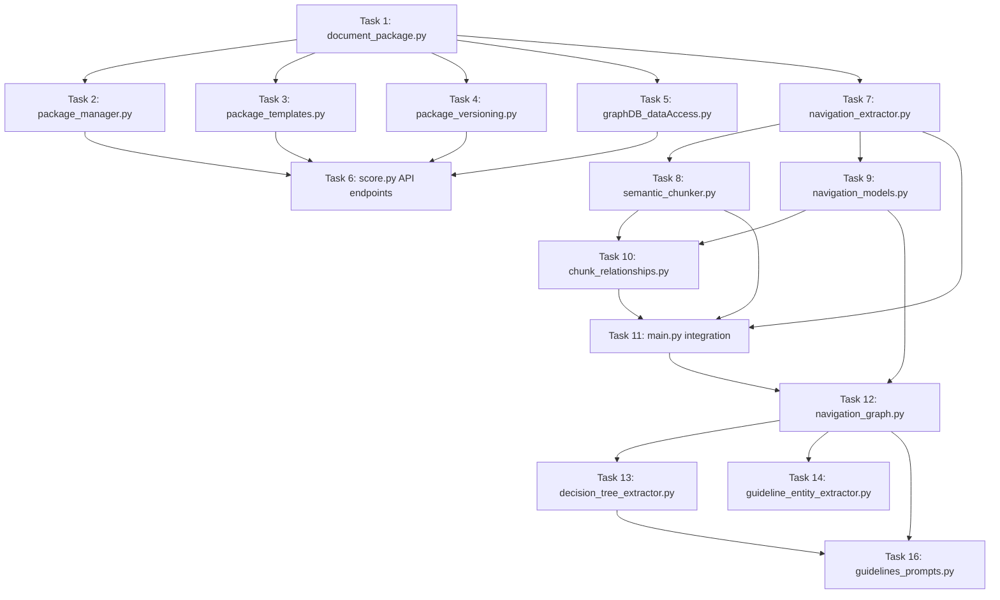
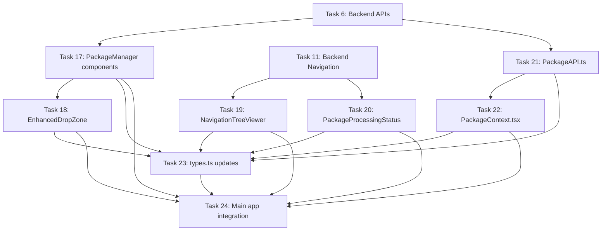

# Phase 1 File Structure & Architecture

## Overview
Complete file structure and architecture for Phase 1 - Document Packages implementation. This includes all new files to be created and modifications to existing files.

---

## Backend File Structure

### New Files to Create

```
backend/src/
├── entities/
│   ├── __init__.py                         # Package initialization
│   ├── document_package.py                 # Task 1: Core package data models
│   └── navigation_models.py                # Task 9: Navigation and chunk models
│
├── prompts/
│   ├── __init__.py                         # Package initialization
│   └── guidelines_prompts.py               # Task 16: Specialized prompts
│
├── package_manager.py                      # Task 2: Package CRUD operations
├── package_templates.py                    # Task 3: Mortgage package templates
├── package_versioning.py                   # Task 4: Version control system
├── navigation_extractor.py                 # Task 7: Document structure extraction
├── semantic_chunker.py                     # Task 8: Hierarchical chunking
├── chunk_relationships.py                  # Task 10: Chunk relationship management
├── navigation_graph.py                     # Task 12: Navigation graph builder
├── decision_tree_extractor.py              # Task 13: Decision tree extraction
└── guideline_entity_extractor.py           # Task 14: Entity extraction with context
```

### Files to Modify

```
backend/
├── src/
│   ├── main.py                             # Task 11: Integrate hierarchical processing
│   ├── graphDB_dataAccess.py               # Task 5: Add package schema support
│   └── shared/
│       └── constants.py                    # Add package-related constants
│
└── score.py                                # Task 6: Add package API endpoints
```

### Test Files to Create

```
backend/tests/
├── entities/
│   ├── test_document_package.py            # Task 1: Package model tests
│   └── test_navigation_models.py           # Task 9: Navigation model tests
│
├── test_package_manager.py                 # Task 2: Package manager tests
├── test_package_templates.py               # Task 3: Template tests
├── test_package_versioning.py              # Task 4: Versioning tests
├── test_navigation_extractor.py            # Task 7: Navigation extraction tests
├── test_semantic_chunker.py                # Task 8: Chunking tests
├── test_chunk_relationships.py             # Task 10: Relationship tests
├── test_navigation_graph.py                # Task 12: Graph builder tests
├── test_decision_tree_extractor.py         # Task 13: Decision tree tests
└── test_guideline_entity_extractor.py      # Task 14: Entity extraction tests
```

---

## Frontend File Structure

### New Files to Create

```
frontend/src/
├── components/
│   ├── PackageManager/
│   │   ├── index.ts                        # Component exports
│   │   ├── PackageManager.tsx              # Task 17: Main package manager
│   │   ├── PackageCreator.tsx              # Task 17: Package creation form
│   │   ├── PackageList.tsx                 # Task 17: Package list display
│   │   └── __tests__/
│   │       ├── PackageManager.test.tsx     # Package manager tests
│   │       ├── PackageCreator.test.tsx     # Creator tests
│   │       └── PackageList.test.tsx        # List tests
│   │
│   ├── Navigation/
│   │   ├── index.ts                        # Component exports
│   │   ├── NavigationTreeViewer.tsx        # Task 19: Tree visualization
│   │   ├── DecisionTreePreview.tsx         # Task 19: Decision tree preview
│   │   └── __tests__/
│   │       ├── NavigationTreeViewer.test.tsx
│   │       └── DecisionTreePreview.test.tsx
│   │
│   ├── DataSources/Local/
│   │   ├── EnhancedDropZone.tsx             # Task 18: Enhanced upload
│   │   └── __tests__/
│   │       └── EnhancedDropZone.test.tsx
│   │
│   └── FileTable/
│       ├── PackageProcessingStatus.tsx      # Task 20: Processing status
│       ├── HierarchicalChunkingProgress.tsx # Task 20: Chunking progress
│       ├── NavigationExtractionProgress.tsx # Task 20: Navigation progress
│       └── __tests__/
│           └── PackageProcessingStatus.test.tsx
│
├── services/
│   ├── PackageAPI.ts                       # Task 21: Package API calls
│   └── __tests__/
│       └── PackageAPI.test.tsx
│
├── context/
│   ├── PackageContext.tsx                  # Task 22: Package state management
│   └── __tests__/
│       └── PackageContext.test.tsx
│
└── hooks/
    ├── usePackageProcessing.tsx            # Custom hook for processing status
    └── useNavigationData.tsx               # Custom hook for navigation data
```

### Files to Modify

```
frontend/src/
├── types.ts                                # Task 23: Add package types
├── Home.tsx                                # Task 24: Integrate package context
├── App.tsx                                 # Task 24: Add package context provider
├── components/
│   ├── Layout/
│   │   └── Header.tsx                      # Task 24: Add package manager button
│   ├── FileTable/
│   │   └── FileTable.tsx                   # Task 24: Show package info
│   └── DataSources/Local/
│       └── DropZone.tsx                    # Task 18: Support additional info
│
└── utils/
    └── Constants.ts                        # Add package-related constants
```

---

## Detailed File Dependencies

### Backend Dependencies



### Frontend Dependencies



---

## Database Schema Changes

### Neo4j Node Types to Add

```cypher
-- Document Package Nodes
(:DocumentPackage {
  package_id: string,
  package_name: string,
  tenant_id: string,
  category: string,
  version: string,
  status: string,
  created_at: datetime,
  updated_at: datetime,
  created_by: string,
  template_type: string
})

-- Package Document Nodes
(:PackageDocument {
  document_id: string,
  package_id: string,
  document_type: string,
  document_name: string,
  expected_structure: map,
  required_sections: [string],
  chunking_strategy: string,
  entity_types: [string]
})

-- Hierarchical Chunk Nodes
(:HierarchicalChunk {
  chunk_id: string,
  content: string,
  navigation_path: string,
  node_type: string,
  level: int,
  chapter_number: int,
  section_number: string,
  token_count: int,
  package_id: string
})

-- Navigation Nodes
(:NavigationNode {
  enhanced_node_id: string,
  node_type: string,
  title: string,
  depth_level: int,
  chapter_number: int,
  section_number: string,
  requires_complete_tree: boolean,
  decision_metadata: map
})

-- Decision Tree Nodes
(:DecisionTreeNode {
  node_id: string,
  decision_type: string,
  title: string,
  content: string,
  logical_expression: string,
  evaluation_precedence: int,
  decision_outcomes: [string],
  default_outcome: map
})
```

### Relationship Types to Add

```cypher
-- Package Relationships
(:DocumentPackage)-[:CONTAINS]->(:PackageDocument)
(:DocumentPackage)-[:VERSION_OF]->(:DocumentPackage)
(:DocumentPackage)-[:COMPETES_WITH]->(:DocumentPackage)
(:DocumentPackage)-[:UPGRADES_FROM]->(:DocumentPackage)

-- Hierarchical Relationships
(:HierarchicalChunk)-[:CONTAINS]->(:HierarchicalChunk)
(:HierarchicalChunk)-[:FOLLOWS]->(:HierarchicalChunk)
(:HierarchicalChunk)-[:REFERENCES]->(:HierarchicalChunk)
(:HierarchicalChunk)-[:PART_OF]->(:NavigationNode)

-- Navigation Relationships
(:NavigationNode)-[:CONTAINS]->(:NavigationNode)
(:NavigationNode)-[:FOLLOWS]->(:NavigationNode)
(:NavigationNode)-[:DECISION_TREE]->(:DecisionTreeNode)

-- Decision Tree Relationships
(:DecisionTreeNode)-[:LEADS_TO]->(:DecisionTreeNode)
(:DecisionTreeNode)-[:RESULTS_IN]->(:DecisionTreeNode)
(:DecisionTreeNode)-[:REQUIRES]->(:DecisionTreeNode)
```

---

## API Endpoints to Add

### Package Management APIs

```typescript
// Package CRUD
POST   /api/v3/packages                     # Create new package
GET    /api/v3/packages                     # List packages (with filters)
GET    /api/v3/packages/{package_id}        # Get specific package
PUT    /api/v3/packages/{package_id}        # Update package
DELETE /api/v3/packages/{package_id}        # Delete package

// Package Operations
POST   /api/v3/packages/{package_id}/clone  # Clone package
POST   /api/v3/packages/{package_id}/apply  # Apply package to documents
GET    /api/v3/packages/{package_id}/history # Get version history

// Package Templates
GET    /api/v3/package-templates            # List available templates
GET    /api/v3/package-templates/{category} # Get templates for category

// Navigation & Processing
GET    /api/v3/files/{file_id}/navigation   # Get navigation structure
GET    /api/v3/files/{file_id}/processing-status # Get processing status
POST   /api/v3/files/{file_id}/reprocess    # Reprocess with different package
```

---

## Configuration Files to Update

### Environment Variables to Add

```bash
# backend/.env additions
PACKAGE_STORAGE_PATH=./packages
NAVIGATION_EXTRACTION_TIMEOUT=300
DECISION_TREE_VALIDATION_STRICT=true
HIERARCHICAL_CHUNKING_MAX_DEPTH=5

# frontend/.env additions
VITE_PACKAGE_MANAGEMENT_ENABLED=true
VITE_NAVIGATION_VIEWER_ENABLED=true
VITE_DECISION_TREE_PREVIEW_ENABLED=true
```

### Package Configuration

```json
// backend/config/package_config.json
{
  "mortgage_categories": ["NQM", "RTL", "SBC", "CONV"],
  "default_templates": {
    "NQM": "NQM_STANDARD",
    "RTL": "RTL_STANDARD", 
    "SBC": "SBC_STANDARD",
    "CONV": "CONV_STANDARD"
  },
  "validation_rules": {
    "min_decision_trees": 1,
    "required_outcomes": ["APPROVE", "DECLINE", "REFER"],
    "max_navigation_depth": 5
  },
  "processing_timeouts": {
    "navigation_extraction": 300,
    "hierarchical_chunking": 180,
    "decision_tree_extraction": 240
  }
}
```

---

## TypeScript Type Definitions

### Core Package Types

```typescript
// frontend/src/types.ts additions

export interface DocumentPackage {
  package_id: string;
  package_name: string;
  tenant_id: string;
  category: 'NQM' | 'RTL' | 'SBC' | 'CONV';
  version: string;
  status: 'DRAFT' | 'ACTIVE' | 'ARCHIVED';
  created_at: string;
  updated_at: string;
  created_by: string;
  template_type: string;
  documents: DocumentDefinition[];
  relationships: PackageRelationship[];
}

export interface NavigationTree {
  nodes: NavigationNode[];
  decision_trees: DecisionTree[];
  metadata: NavigationMetadata;
}

export interface HierarchicalChunk {
  chunk_id: string;
  content: string;
  navigation_path: string;
  node_type: string;
  level: number;
  parent_id?: string;
  children_ids: string[];
  chapter_context: string;
  section_context: string;
  token_count: number;
  embeddings?: number[];
  metadata: Record<string, any>;
}

export interface DecisionTree {
  section_id: string;
  root: DecisionNode;
  branches: DecisionNode[];
  leaves: DecisionLeafNode[];
  flow: DecisionFlow;
  paths: DecisionPath[];
  is_complete: boolean;
}

export interface ProcessingStep {
  name: string;
  description: string;
  status: 'pending' | 'in_progress' | 'completed' | 'failed';
  progress?: number;
  details?: Record<string, any>;
}
```

---

## Testing Structure

### Backend Test Coverage

```
backend/tests/
├── unit/                                   # Unit tests for individual functions
│   ├── entities/
│   ├── package_operations/
│   ├── navigation/
│   └── decision_trees/
│
├── integration/                            # Integration tests
│   ├── test_package_workflow.py           # End-to-end package operations
│   ├── test_hierarchical_processing.py    # Complete processing pipeline
│   └── test_api_endpoints.py              # API endpoint testing
│
└── fixtures/                              # Test data and fixtures
    ├── sample_packages/
    ├── sample_documents/
    └── expected_outputs/
```

### Frontend Test Coverage

```
frontend/src/__tests__/
├── components/                             # Component tests
│   ├── PackageManager/
│   ├── Navigation/
│   └── DataSources/
│
├── services/                              # Service layer tests
├── context/                               # Context provider tests
├── hooks/                                 # Custom hook tests
│
├── integration/                           # Integration tests
│   ├── package-upload-flow.test.tsx      # Full upload workflow
│   └── navigation-viewer.test.tsx        # Navigation interaction
│
└── e2e/                                   # End-to-end tests
    ├── package-management.spec.ts
    └── document-processing.spec.ts
```

---

## Build and Deployment Changes

### Docker Updates

```dockerfile
# backend/Dockerfile additions
COPY src/entities/ /app/src/entities/
COPY src/prompts/ /app/src/prompts/
COPY config/package_config.json /app/config/

# Install additional dependencies for navigation processing
RUN pip install python-docx PyPDF2 nltk spacy
```

### CI/CD Pipeline Updates

```yaml
# .github/workflows/test.yml additions
- name: Test Package Management
  run: |
    cd backend
    python -m pytest tests/test_package_manager.py -v
    python -m pytest tests/test_navigation_extractor.py -v

- name: Test Frontend Package Components  
  run: |
    cd frontend
    npm test -- --testPathPattern="PackageManager|Navigation" --coverage
```

---

## Documentation Updates

### Files to Update

```
docs/
├── backend/
│   ├── package-management.md              # Package system documentation
│   ├── hierarchical-processing.md         # Processing pipeline docs
│   └── decision-trees.md                  # Decision tree extraction
│
├── frontend/
│   ├── package-components.md              # UI component documentation
│   └── navigation-viewer.md               # Navigation interface docs
│
└── api/
    └── package-endpoints.md                # API documentation
```

### README Updates

```markdown
# README.md additions

## Phase 1: Document Packages

### New Features
- Document package management system
- Hierarchical document processing
- Navigation structure extraction
- Decision tree visualization
- Enhanced upload flow with package selection

### Usage
```bash
# Create a new document package
curl -X POST /api/v3/packages \
  -F "package_name=NQM Titanium Package" \
  -F "category=NQM" \
  -F "template=NQM_STANDARD"

# Upload documents with package
curl -X POST /api/v3/extract \
  -F "file=@document.pdf" \
  -F "package_id=pkg_nqm_001"
```

### Architecture
- **Backend**: Package management, hierarchical chunking, decision tree extraction
- **Frontend**: Package UI, navigation viewer, enhanced upload flow
- **Database**: Extended Neo4j schema with package and navigation nodes
```

This comprehensive file structure provides the foundation for implementing Phase 1 - Document Packages with clear organization, dependencies, and architecture.