# Phase 1 Implementation Timeline

## Overview
Detailed timeline for Phase 1 - Document Packages implementation across 3 weeks, following the iterative backend-first approach with frontend integration phases.

---

# Timeline Overview

```mermaid
gantt
    title Phase 1 - Document Packages Implementation Timeline
    dateFormat  X
    axisFormat %d
    
    section Phase 1.1: Package Architecture
    Task 1: Package Models          :task1, 0, 2
    Task 2: Package Manager         :task2, 1, 4
    Task 3: Package Templates       :task3, 2, 4
    Task 4: Package Versioning     :task4, 3, 6
    Task 5: Database Schema        :task5, 3, 5
    Task 6: API Endpoints          :task6, 5, 8
    
    section Phase 1.2: Hierarchical Chunking
    Task 7: Navigation Extractor   :task7, 6, 10
    Task 8: Semantic Chunker       :task8, 8, 11
    Task 9: Navigation Models      :task9, 7, 9
    Task 10: Chunk Relationships  :task10, 9, 12
    Task 11: Pipeline Integration  :task11, 10, 13
    
    section Phase 1.3: Guidelines Navigation  
    Task 12: Navigation Graph      :task12, 11, 15
    Task 13: Decision Tree Extract :task13, 13, 17
    Task 14: Entity Extractor      :task14, 14, 17
    Task 15: Tree Validation       :task15, 15, 17
    Task 16: Enhanced Prompts      :task16, 16, 19
    
    section Phase 1.5: Frontend Integration
    Task 17: Package Components    :task17, 17, 21
    Task 18: Enhanced Upload       :task18, 19, 22
    Task 19: Navigation Viewer     :task19, 18, 22
    Task 20: Processing Status     :task20, 20, 23
    Task 21: Package API Service   :task21, 17, 19
    Task 22: Package Context       :task22, 19, 21
    Task 23: Type Definitions      :task23, 21, 23
    Task 24: Main Integration      :task24, 22, 25
```

---

# Week 1: Backend Foundation (Phase 1.1)

## Week 1.0 - 1.5: Package Architecture Foundation

### Monday (Day 1-2): Core Data Models
**Focus**: Establish fundamental package structures

#### Task 1: Create Package Data Models (Day 1: 2 hours)
- **9:00-11:00**: Implement DocumentPackage, DocumentDefinition, PackageRelationship dataclasses
- **Dependencies**: None
- **Deliverable**: `backend/src/entities/document_package.py`
- **Validation**: Unit tests pass, all models serialize correctly

#### Task 2: Create Package Manager Core (Day 1-2: 3 hours) 
- **11:00-12:00**: PackageManager class structure  
- **Day 2 9:00-11:00**: CRUD operations implementation
- **Dependencies**: Task 1
- **Deliverable**: `backend/src/package_manager.py`
- **Validation**: Create, load, update, clone operations functional

### Tuesday (Day 2-3): Templates and Versioning

#### Task 3: Create Package Templates (Day 2: 2 hours)
- **14:00-16:00**: MortgagePackageTemplates with NQM, RTL, SBC, CONV templates
- **Dependencies**: Task 1
- **Deliverable**: `backend/src/package_templates.py`
- **Validation**: All category templates validate and instantiate

#### Task 4: Implement Package Versioning (Day 3: 3 hours)
- **9:00-12:00**: PackageVersionManager with semantic versioning
- **Dependencies**: Task 1
- **Deliverable**: `backend/src/package_versioning.py`
- **Validation**: Version creation, history, rollback, diff working

### Wednesday (Day 3-4): Database Integration

#### Task 5: Create Package Database Schema (Day 3: 2 hours)
- **14:00-16:00**: Neo4j nodes, relationships, database access methods
- **Dependencies**: Task 1
- **Deliverable**: Updated `backend/src/graphDB_dataAccess.py`
- **Validation**: Package CRUD operations in database functional

#### Task 6: Add Package API Endpoints (Day 4: 3 hours)
- **9:00-12:00**: REST API endpoints in score.py
- **Dependencies**: Tasks 2, 3, 4, 5
- **Deliverable**: Updated `backend/score.py`
- **Validation**: All API endpoints respond correctly, authentication working

### Week 1 Milestone Validation
- [ ] Package creation and management functional
- [ ] Template system operational  
- [ ] Version control working
- [ ] Database schema deployed
- [ ] API endpoints tested and documented

---

# Week 1.5-2: Hierarchical Processing (Phase 1.2)

## Week 1.5-2: Navigation and Chunking Implementation

### Thursday-Friday (Day 4-5): Navigation Foundation

#### Task 7: Create Navigation Extractor (Day 4-5: 4 hours)
- **Day 4 14:00-16:00**: NavigationExtractor class and patterns
- **Day 5 9:00-11:00**: Table of contents and heading detection
- **Dependencies**: Task 1
- **Deliverable**: `backend/src/navigation_extractor.py`
- **Validation**: Navigation extraction >95% accuracy on test documents

#### Task 9: Create Hierarchical Chunk Models (Day 5: 2 hours)
- **11:00-13:00**: NavigationNode, HierarchicalChunk dataclasses
- **Dependencies**: Task 7
- **Deliverable**: `backend/src/entities/navigation_models.py`
- **Validation**: All models serialize, validation methods work

### Monday (Day 6-7): Semantic Chunking

#### Task 8: Implement Semantic Chunker (Day 6: 3 hours)
- **9:00-12:00**: SemanticChunker class with hierarchy-aware processing
- **Dependencies**: Task 7
- **Deliverable**: `backend/src/semantic_chunker.py`
- **Validation**: Hierarchical chunks maintain structure, context preserved

#### Task 10: Implement Chunk Relationships (Day 7: 3 hours)
- **9:00-12:00**: ChunkRelationshipManager with all relationship types
- **Dependencies**: Tasks 8, 9
- **Deliverable**: `backend/src/chunk_relationships.py`
- **Validation**: All relationship types created correctly

### Tuesday (Day 7-8): Pipeline Integration

#### Task 11: Update Main Processing Pipeline (Day 7-8: 3 hours)
- **Day 7 14:00-16:00**: Modify main.py integration points
- **Day 8 9:00-10:00**: Backward compatibility testing
- **Dependencies**: Tasks 7, 8, 10
- **Deliverable**: Updated `backend/src/main.py`
- **Validation**: Hierarchical processing integrated, existing functionality preserved

### Week 1.5-2 Milestone Validation
- [ ] Navigation extraction accuracy >95%
- [ ] Hierarchical chunking functional
- [ ] Chunk relationships established
- [ ] Pipeline integration successful
- [ ] Backward compatibility maintained

---

# Week 2-2.5: Guidelines Navigation (Phase 1.3)

## Week 2-2.5: Decision Trees and Entity Extraction

### Wednesday-Thursday (Day 8-10): Navigation Graph Building

#### Task 12: Create Navigation Graph Builder (Day 8-9: 4 hours)
- **Day 8 11:00-13:00**: NavigationGraphBuilder class structure
- **Day 9 9:00-11:00**: Complete structure extraction and validation
- **Dependencies**: Tasks 9, 11
- **Deliverable**: `backend/src/navigation_graph.py`
- **Validation**: Complete navigation graphs built from documents

#### Task 13: Implement Decision Tree Extractor (Day 9-10: 4 hours)  
- **Day 9 14:00-16:00**: DecisionTreeExtractor with completeness requirements
- **Day 10 9:00-11:00**: Mandatory outcome creation (APPROVE/DECLINE/REFER)
- **Dependencies**: Task 12
- **Deliverable**: `backend/src/decision_tree_extractor.py`
- **Validation**: 100% decision tree completeness, all paths have outcomes

### Friday (Day 10-11): Entity Extraction

#### Task 14: Create Guidelines Entity Extractor (Day 10: 3 hours)
- **14:00-17:00**: GuidelineEntityExtractor with mortgage domain patterns
- **Dependencies**: Task 12
- **Deliverable**: `backend/src/guideline_entity_extractor.py`
- **Validation**: Mortgage entities extracted with navigation context

#### Task 15: Implement Decision Tree Validation (Day 11: 2 hours)
- **9:00-11:00**: Completeness validation and quality metrics
- **Dependencies**: Task 13
- **Deliverable**: Validation framework in decision tree extractor
- **Validation**: All decision trees validated for completeness

### Monday (Day 11-12): Prompts and Enhancement

#### Task 16: Create Enhanced Processing Prompts (Day 11-12: 3 hours)
- **Day 11 14:00-16:00**: GuidelinesPromptEngine class
- **Day 12 9:00-10:00**: Category-specific prompts and optimization
- **Dependencies**: Tasks 12, 13
- **Deliverable**: `backend/src/prompts/guidelines_prompts.py`
- **Validation**: Prompts improve extraction accuracy

### Week 2-2.5 Milestone Validation
- [ ] Navigation graphs complete and accurate
- [ ] Decision tree completeness = 100%
- [ ] Entity extraction quality >90%
- [ ] Validation framework operational
- [ ] Enhanced prompts improve performance

---

# Week 2.5-3: Frontend Integration (Phase 1.5)

## Week 2.5-3: User Interface Implementation

### Tuesday-Wednesday (Day 12-14): Package Management UI

#### Task 21: Create Package API Services (Day 12: 2 hours)
- **11:00-13:00**: PackageAPI.ts service layer
- **Dependencies**: Task 6
- **Deliverable**: `frontend/src/services/PackageAPI.ts`
- **Validation**: All API calls functional with proper error handling

#### Task 17: Create Package Management Components (Day 12-13: 4 hours)
- **Day 12 14:00-16:00**: PackageManager component structure
- **Day 13 9:00-11:00**: PackageCreator and PackageList components
- **Dependencies**: Task 21
- **Deliverable**: `frontend/src/components/PackageManager/`
- **Validation**: Package CRUD operations working in UI

#### Task 22: Add Package Context Provider (Day 13: 2 hours)
- **14:00-16:00**: PackageContext for state management
- **Dependencies**: Task 21
- **Deliverable**: `frontend/src/context/PackageContext.tsx`
- **Validation**: Package state management functional

### Thursday (Day 14-15): Upload and Navigation UI

#### Task 19: Create Navigation Viewer (Day 14-15: 4 hours)
- **Day 14 9:00-11:00**: NavigationTreeViewer component structure
- **Day 15 9:00-11:00**: DecisionTreePreview integration
- **Dependencies**: Task 11
- **Deliverable**: `frontend/src/components/Navigation/`
- **Validation**: Document navigation visualized, decision trees displayed

#### Task 18: Enhance Upload Flow (Day 15: 3 hours)
- **14:00-17:00**: EnhancedDropZone with package selection
- **Dependencies**: Task 17
- **Deliverable**: `frontend/src/components/DataSources/Local/EnhancedDropZone.tsx`
- **Validation**: Package-based upload working, backward compatible

### Friday (Day 15-16): Processing Status and Integration

#### Task 20: Implement Package Processing Status (Day 15-16: 3 hours)
- **Day 15 14:00-16:00**: PackageProcessingStatus component
- **Day 16 9:00-10:00**: Processing step visualization
- **Dependencies**: Task 11
- **Deliverable**: `frontend/src/components/FileTable/PackageProcessingStatus.tsx`
- **Validation**: Package processing steps visible, real-time updates

#### Task 23: Update Type Definitions (Day 16: 2 hours)
- **11:00-13:00**: Complete TypeScript types for all package features
- **Dependencies**: Tasks 17-22
- **Deliverable**: Updated `frontend/src/types.ts`
- **Validation**: Full type coverage, no TypeScript errors

#### Task 24: Integrate with Main Application (Day 16-17: 3 hours)
- **Day 16 14:00-16:00**: Update Home.tsx, Header.tsx, FileTable.tsx
- **Day 17 9:00-10:00**: End-to-end testing and validation
- **Dependencies**: Tasks 17-23
- **Deliverable**: Updated main application components
- **Validation**: Seamless package workflow, zero breaking changes

### Week 2.5-3 Milestone Validation
- [ ] Package management UI fully functional
- [ ] Enhanced upload flow operational
- [ ] Navigation visualization working
- [ ] Processing status displays correctly
- [ ] Full application integration successful

---

# Phase 1 Completion Validation (Week 3)

## Final Integration and Testing (Day 17-21)

### Monday-Tuesday (Day 17-19): Integration Testing
- **Comprehensive End-to-End Testing**: Full package workflow validation
- **Performance Testing**: Load testing with realistic document volumes
- **Regression Testing**: Existing functionality verification
- **User Acceptance Testing**: Stakeholder validation

### Wednesday-Thursday (Day 19-21): Deployment Preparation
- **Documentation Completion**: API docs, user guides, technical documentation
- **Deployment Scripts**: Database migrations, feature flags, monitoring setup
- **Staging Deployment**: Full system deployment to staging environment
- **Production Readiness Review**: Security, performance, compliance validation

### Friday (Day 21): Go-Live
- **Production Deployment**: Phased rollout with monitoring
- **User Training**: Team training on new package features
- **Support Preparation**: Support documentation and escalation procedures
- **Success Metrics Baseline**: Establish baseline metrics for monitoring

---

# Daily Schedule Template

## Typical Development Day Structure

### Morning (9:00-12:00): Core Development
- **9:00-9:15**: Daily standup and priority review
- **9:15-11:00**: Primary task implementation
- **11:00-11:15**: Break
- **11:15-12:00**: Secondary task or testing

### Afternoon (13:00-17:00): Integration and Testing
- **13:00-14:00**: Code review and documentation
- **14:00-16:00**: Integration work and testing
- **16:00-16:15**: Break
- **16:15-17:00**: Next-day preparation and task handoff

## Weekly Review Schedule

### Monday: Sprint Planning
- Review previous week's completion
- Prioritize current week's tasks
- Identify dependencies and blockers

### Wednesday: Mid-week Checkpoint
- Progress assessment
- Risk identification and mitigation
- Resource reallocation if needed

### Friday: Sprint Review
- Deliverable validation
- Quality assessment
- Next week's preparation

---

# Risk Mitigation Timeline

## High-Priority Risks

### Week 1: Package Architecture Risks
- **Risk**: Database schema conflicts
- **Mitigation**: Schema validation in development environment by Day 3
- **Contingency**: Rollback plan and alternative schema design

### Week 1.5-2: Processing Integration Risks  
- **Risk**: Performance degradation in hierarchical processing
- **Mitigation**: Performance benchmarking throughout development
- **Contingency**: Optimization techniques and caching strategies

### Week 2-2.5: Decision Tree Extraction Risks
- **Risk**: Incomplete decision tree extraction
- **Mitigation**: Validation framework and quality gates
- **Contingency**: Manual decision tree completion tools

### Week 2.5-3: Frontend Integration Risks
- **Risk**: UI/UX consistency issues
- **Mitigation**: Design review checkpoints every 2 days
- **Contingency**: Component rollback and design iteration

## Daily Risk Assessment
- **Morning**: Review overnight integration results
- **Midday**: Assess current task risks and blockers
- **Evening**: Plan risk mitigation for next day

---

# Success Metrics Timeline

## Weekly Metrics Collection

### Week 1 Metrics
- Package creation success rate
- API response times
- Database operation performance
- Code coverage percentage

### Week 1.5-2 Metrics
- Navigation extraction accuracy
- Chunking performance comparison
- Integration test pass rate
- Processing speed benchmarks

### Week 2-2.5 Metrics
- Decision tree completeness rate
- Entity extraction quality
- Validation accuracy
- End-to-end processing success

### Week 2.5-3 Metrics
- UI responsiveness
- User workflow completion rate
- Integration test coverage
- Performance regression analysis

## Go-Live Success Criteria
- [ ] All acceptance criteria met (100%)
- [ ] Performance benchmarks achieved (>95%)
- [ ] Zero critical bugs in production
- [ ] User satisfaction >4.5/5
- [ ] System uptime >99.9%

This detailed timeline ensures systematic, risk-aware implementation of Phase 1 with clear milestones, dependencies, and validation criteria at each stage.